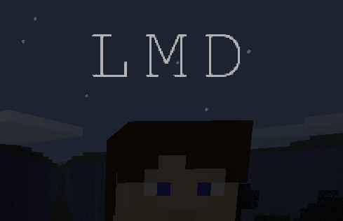

# Player Nametags (`playertags`)

Adds player nametags floating above players.

## About

Depends on [`modlib`](https://github.com/appgurueu/modlib). Code licensed under the MIT License. Written by Lars Mueller aka LMD or appguru(eu).

The FreeMono characters are licensed under the [GNU GPLv3 + font exception](https://www.gnu.org/software/freefont/). `playertag_bg.png` is available under the same license or alternatively CC0.

## Links

* [GitHub](https://github.com/appgurueu/playertags) - sources, issue tracking, contributing
* [Discord](https://discordapp.com/invite/ysP74by) - discussion, chatting
* [Minetest Forum](https://forum.minetest.net/viewtopic.php?t=20339) - (more organized) discussion
* [ContentDB](https://content.minetest.net/packages/LMD/playertags/) - releases (cloning from GitHub is recommended)

## Screenshot

## Setup

Install the mod like any other, using `git clone https://github.com/appgurueu/playertags.git` or installing via ContentDB & the in-game content manager. Enable it & `modlib` and you're done.

## Features

Shows colored player nametags floating above players. Configurable.

## Configuration

### `glow`

Value from `0` to `15`. Indicates brightness when it's dark. 15 means full brightness. Default is `7`.

### `size`

Positive number. Nametag size (character width) in blocks. Default is `0.25`. If set to 0, nametags are just disabled.

### `step`

Positive number. Each `step` seconds the nametag updates. Default is `0.1`.